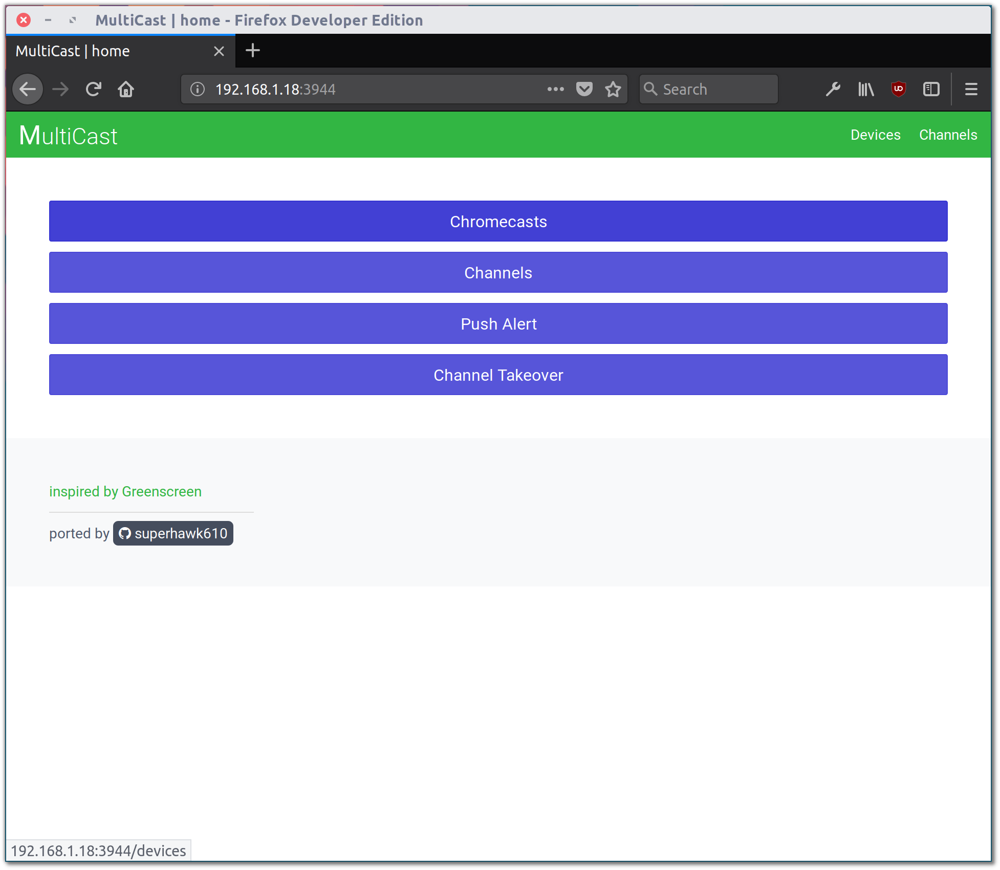
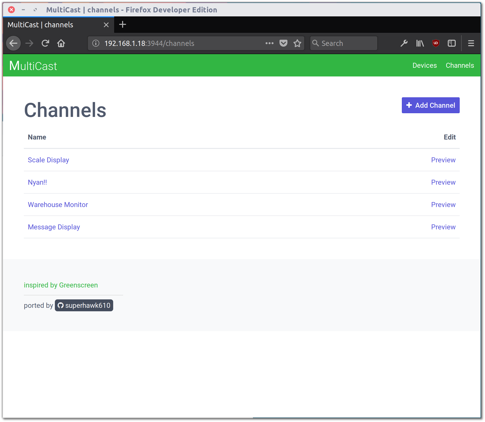
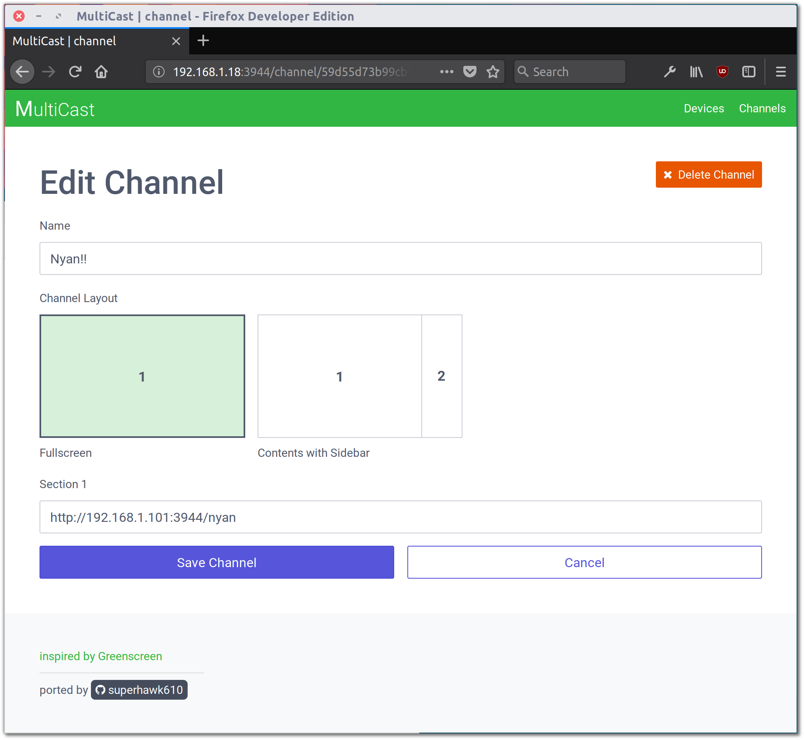
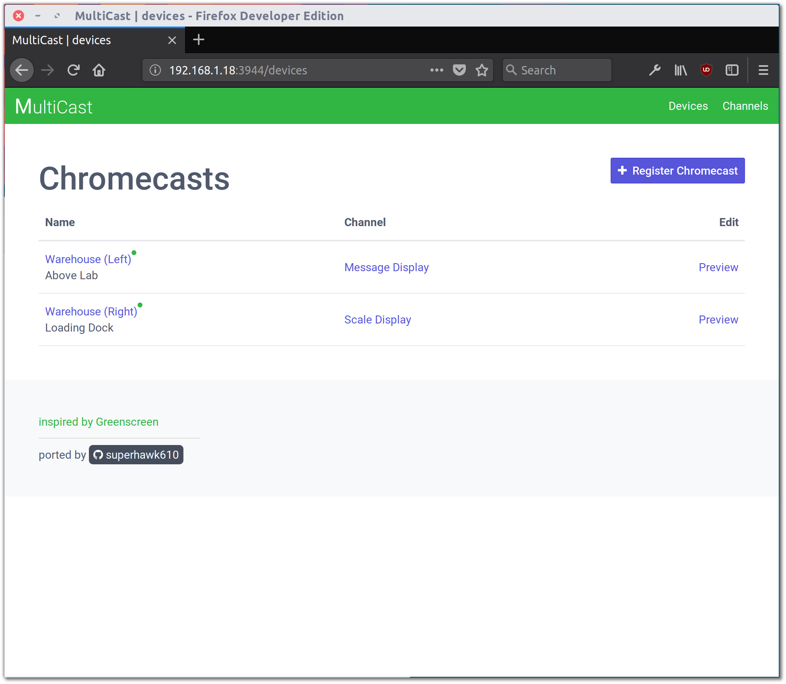
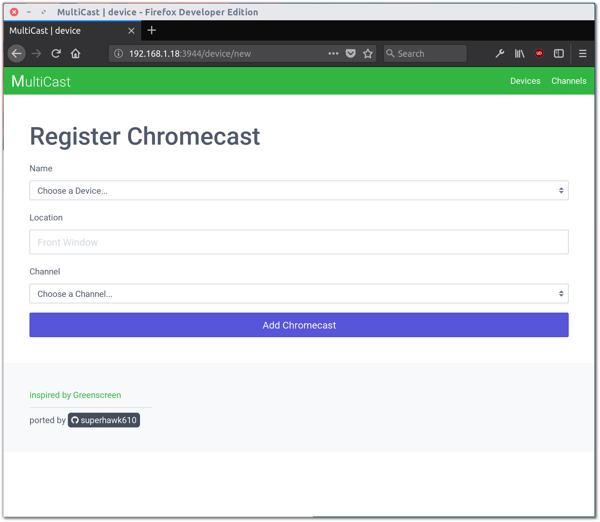
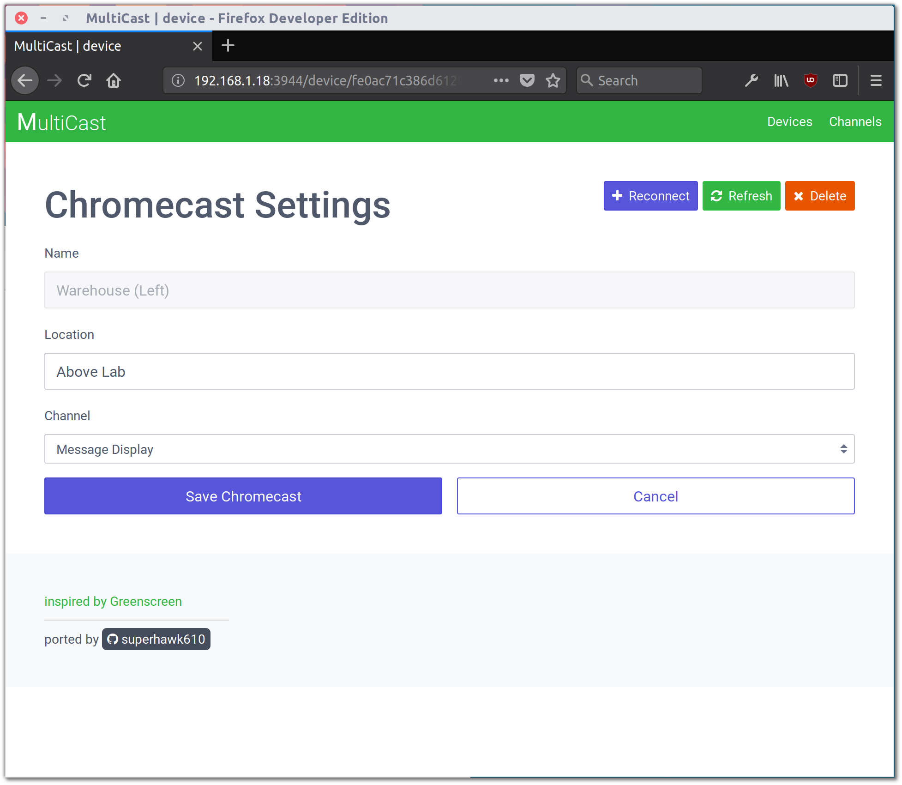
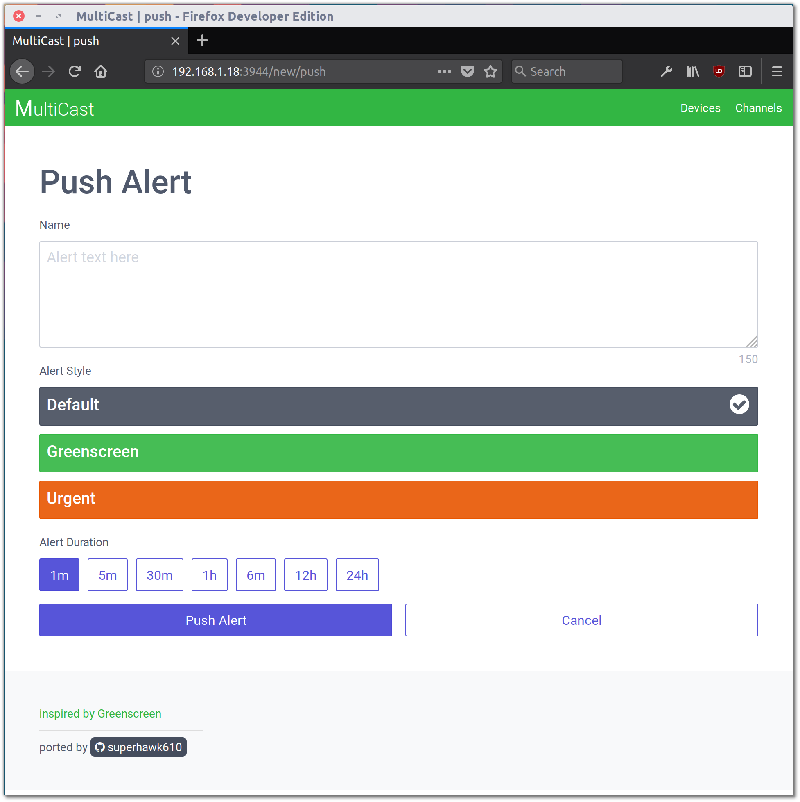
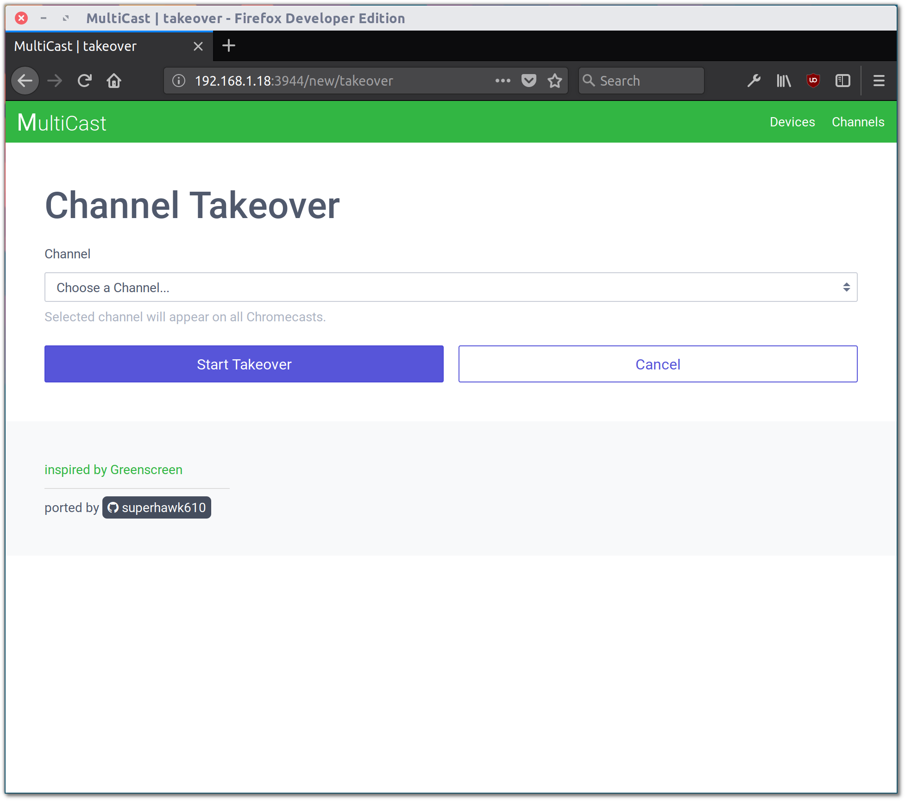

MultiCast v1.0
=========

[](https://badge.fury.io/js/multicast)

:green_heart: A persistent solution to presenting content across multiple Chromecast devices, inspired by [Greenscreen](http://greenscreen.io/).

Developed with Node, Express, and Mongo.

## Usage

### Home


From the home page, you can manage displays via Chromecasts, manage all available content via Channels, create and trigger alerts via Push Alerts, or takeover all display by starting a Takeover.

### Channels


All content is managed via Channels, which are unique URLs that can be assigned to each individual device. There is no limit on the number of Channels you can have available at any one time, and you can freely switch between them on a per-device basis.

To access Channels, select Channels from the homepage, or click Channels in the top right of the interface.



A channel consists of a Name and Layout. The channel's name will be used to refer to it throughout the interface, but will never be displayed on the actual device when it is being cast. The channel's layout allows one or more URLs to be embedded (via iframe) into the page that will be cast. Two layouts are provided, though creating additional layouts is not especially difficult (see [Creating Layouts](#creating-layouts)).

### Devices


Chromecast devices are now interfaced with as mDNS devices via the new [Castv2 API](https://github.com/thibauts/node-castv2). This removes the Chrome/Chromium browser restriction that previously existed with Chromecast devices, and even allows Multicast to be run remotely from a headless server (see [Setup](#setup)).

All Chromecast devices on the same network as the host will display here. Devices can be *registered* to be activated as Multicast receivers and assigned a channel, receive push alerts, and so on.

To register a device, click on the device's name or click Register Chromecast.



A device's name will be whatever the Chromecast's name was when it was set up. A device's Location can be set to anything you would like to clarify where it is located. Make sure to choose something descriptive, as this will make Channel management easier down the line.

You can choose not to select a Channel when registering a device - doing so will leave the device on the default registration screen until a Channel is selected.



Once a device has been registered, you can select its name from the Devices list to change the Channel it is displaying, refresh its Channel content, or Reconnect it if loses connection.

### Push Alerts


Push Alerts are useful for displaying small pieces of information to all receiver devices. Alerts will begin displaying on all connected receivers as soon as they are created, and will continue to display until their set duration is reached or the receiver is reset.

### Channel Takeover


A Channel Takeover allows all receiver devices to be temporarily, indefinitely redirected to a single channel. A Takeover will begin immediately after it is started, and will last until it is manually stopped from the homepage.

**Takeovers will also affect devices that are registered after they have begun.*

## Getting Started

### Prerequisites

This project requires Node.js and NPM (bundled with Node), as well as a MongoDB server. Since Node is cross-platform, it should work on Windows, MacOS, and Linux.

This project depends on [node_mdns](https://github.com/agnat/node_mdns), which in turn requires a mDNS stack. Follow the installation instructions [here](https://github.com/agnat/node_mdns#installation) for whichever platform you are on to install a mDNS stack. If you're on Linux, this is as simple as

#### Debian/Ubuntu
```shell
sudo apt-get install build-essential libavahi-compat-libdnssd-dev
```

#### RedHat/Fedora/CentOS
```shell
sudo yum install gcc gcc-c++ avahi avahi-compat-libdns_sd avahi-compat-libdns_sd-devel
```

### Setup

If you don't already have access to a MongoDB server installation, follow the guide [here](https://docs.mongodb.com/manual/administration/install-community/).

Grab the latest stable copy of Node/NPM from [here](https://nodejs.org/en/download/) or install it via [nvm](http://nvm.sh).

In order to access the Chromecast API, you need to [register as a Cast developer](https://cast.google.com/publish/) (it costs $5).

Once you've done this, log in to the [Cast Developer SDK Console](https://cast.google.com/u/1/publish/#/overview) and click **Add New Application**. Choose **Custom Receiver**, then name it `Multicast` and set the **Receiver Application URL** to `http://YOUR_LOCAL_IP:3944/landing`. Disable **Guest Mode** and then **Save**.

You now need to register your Chromecast devices as developer devices. For each device, locate the Serial Number (located on the back of the device and on the box), click **Add New Device**, and enter the Serial Number and a brief Description. (**NOTE**: This may take up to 15 minutes to take effect. Go grab a cup of coffee and then head back.)

Installation is a snap with NPM.

```shell
npm i multicast -g
multicast config
multicast start
```

Head over to `http://YOUR_LOCAL_IP:3944/` in your browser to get started, then simply follow the [Usage](#usage) guide to get off the ground.

For development, you can install locally via Github - clone this repository to your local machine, then head into the cloned directory and create a `.config` file for your setup.

```shell
git clone https://github.com/superhawk610/multicast
cd multicast
cp .config.template .config
vim .config
```

**NOTE**: You should leave `mongoAuthSource` and `mongoPort` set to their default unless you know what you're doing.

Install Node modules

```shell
npm install
```

Build files using Gulp

```shell
gulp
```

Run the application

```shell
node .
```

### Firewall Settings

In order for a Chromecast to establish and maintain a connection with a Cast sender, the sender must open two ports:

```html
1900/UDP    (DIAL)
5353/UDP    (mDNS)
```

Make sure that the device running MultiCast has these ports open, as well as the standard HTTP ports

```html
80/TCP/UDP  (HTTP)
443/TCP/UDP (HTTPS)
```

### Flags

`--serve-only` - Do not attempt to connect to any devices, just serve files via Express. Useful for debugging.

## Having Trouble?

### Common Errors

```html
*** WARNING *** The program 'nodejs' uses the Apple Bonjour compatibility layer of Avahi.
*** WARNING *** Please fix your application to use the native API of Avahi!
*** WARNING *** For more information see http://0pointer.de/avahi-compat?s=libdns_sd&e=nodejs
*** WARNING *** The program 'nodejs' called 'DNSServiceRegister()' which is not supported (or only supported partially) in the Apple Bonjour compatibility layer of Avahi.
*** WARNING *** Please fix your application to use the native API of Avahi!
*** WARNING *** For more information see http://0pointer.de/avahi-compat?s=libdns_sd&e=nodejs&f=DNSServiceRegister
```

Don't worry about this. This warning shows up in all Node apps on Linux that depend on `libavahi-compat-libdnssd-dev`. You can safely ignore it.

**Can't launch after installing via NPM?**
Make sure your `NODE_PATH` environment variable correctly includes the global store for node dependencies. On Linux:

```shell
export NODE_PATH=/opt/lib/node_modules
```

**Multicast can't find your devices?**
Make sure they've already been setup and powered on and the display that they're connected to is powered on and displaying their output.

If you can view them from other Cast-enabled apps but not from Multicast, its likely an issue with your firewall. Make sure you configured your firewall correctly (see [Firewall Settings](#firewall-settings)).

**Using Node 8.6+?**

**EDIT:** This has been patched as of node_mdns 2.3.4. This fix is no longer required.

The most recent version of node_mdns has an incompatibility with v8.6 due to changed syntax for a method (see [this pull request](https://github.com/agnat/node_mdns/pull/200)). Until it is fixed in the main branch, you will need to patch it yourself. Edit `node_modules/mdns/lib/resolver_sequence_tasks.js` and make the following change (roughly line 115):

```diff

   function getaddrinfo_0_11(host, family, cb) {
     var req = new cares.GetAddrInfoReqWrap()
-      , err = cares.getaddrinfo(req, host, family)
+      , err = cares.getaddrinfo(req, host, family, 0, false)
       ;
     req.oncomplete = function oncomplete(err, addresses) {
         getaddrinfo_complete(err, addresses, cb);

```

**Using CentOS?**
There appears to be a number of issues when running on CentOS, and we are actively attempting to address them. See #23 for status and updates.

### Issues

If you run into any problems while using this, please report them [here](https://github.com/superhawk610/multicast/issues).

## Authors

 Aaron Ross - *initial work* - [superhawk610](https://github.com/superhawk610)

 [Brekmister](https://github.com/Brekmister) - *contributor*

 Mark Stenglein - *contributor* - [ocelotsloth](https://github.com/ocelotsloth)

## Contributing

- Follow the existing code formatting (2 spaces, not tabs, no hanging brackets, no semicolons, etc)
- Comment your code to explain anything more complex than a routine action
- Provide rationale for any changes you request
- Use thorough commit/pull request messages

### Active Branches

**main** (*stable*) all features in this branch are fully implemented and ready to go

**api** (*unstable*) this branch implements receiver grouping and remote control by splitting all functions out into an independent REST API

**rotation** (*stable*) this branch adds the ability to display channels at 90/180/270 degress of rotation

**authentication** (*unstable*) this branch adds a login page and POST/DELETE request verification

**logging** (*unstable*) this branch adds real-time logging & monitoring of all console/page-load errors from receiver devices back to Multicast's web interface

### Creating Layouts

Creating a channel layout is simple, and consists of two things:

**CSS Layout**

Copy `app/views/layouts/template.pug` and change the name to your new channel layout name (e.g. - `my-layout.pug`).

Change the class applied to the body to the name of your channel layout (e.g. - `body.my-layout`).

In `build/css/channel.css`, add rules to style each `iframe` in your layout, prefixing each with <code>body.<em>layout-name</em></code>, replacing *layout-name* with your layout name. Refer to the existing rules for inspiration.

**NOTE**: Channel sections are currently limited to 4 per channel. To increase this, change `maxSectionCount` on `app/views/channel.pug`. 

**CSS Icon Design**

In `app/views/channel.pug`, add a div under `#channel-layout` with the class `layout` and <code><em>layout-name</em></code>, again replacing *layout-name* with your layout name. Make sure this div has the class `active` when the channel is using your layout, as such:

<pre><code>.layout.<em>layout-name</em>(class=(channel && channel.layout == '<em>layout-name</em>' ? 'active' : ''))</code></pre>

Style this div in `build/css/channel-edit.css` to conform to the existing channel layouts:

```css
width: 250px;
height: 150px;
border: 1px solid rgb(202, 206, 215);
```

Once you finish, don't forget to `gulp` everything to apply your new layout.

## License

This project is licensed under the MIT License - see [LICENSE](LICENSE) for more details.

## Acknowledgments

Special thanks to [Greenscreen](https://github.com/groupon/greenscreen) and the team over at Groupon for inspiring this product.
