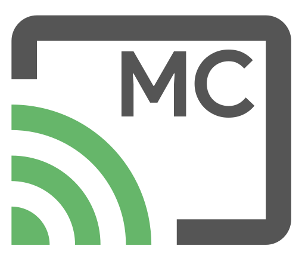

<br />
<br />
<p align="center">
  
</p>
<br />

<h2 align="center"><strong>MultiCast</strong></h2>
<p align="center">
  A persistent solution to presenting content across multiple Chromecast devices, inspired by <a href="http://greenscreen.io/">Greenscreen</a>.
</p>

<p align="center">
  Developed with <a href="https://github.com/nodejs/node">Node</a>, <a href="https://github.com/facebook/react">React</a>, and <a href="https://github.com/apollographql">Apollo</a>.
</p>

<br />
<p align="center">
  
  
</p>
<br />

## PRE-RELEASE

This branch is in an **unstable**, **pre-release** state. Use at your own risk. You've been warned.

## Usage

TODO: Usage instructions.

## Migration (2.x -> 3.0)

If you're migrating an existing Multicast 2.x installation, follow the [Setup](#setup) instructions as normal but skip the initial section around registering for a Chromecast Developer account (you should
already have one). Unfortunately there's no automated tool for importing channels from an existing
installation, so once you're up and running you'll need to manually create any channels from your
existing install.

## Getting Started

### Prerequisites

This project requires a recent version of Node.js. Since Node is cross-platform, it should work on Windows, MacOS, and Linux. See [here](https://nodejs.org/) for installation instructions for your platform.

### Register as a Cast Developer

In order to access the Chromecast API, you need to [register as a Cast developer](https://cast.google.com/publish/) (it costs \$5).

Once you've done this, log in to the [Cast Developer SDK Console](https://cast.google.com/u/1/publish/#/overview) and click **Add New Application**. Choose **Custom Receiver**, then name it `Multicast` and set the **Receiver Application URL** to `http://YOUR_LOCAL_IP:3944/landing`. Disable **Guest Mode** and then **Save**.

**NOTE:** Make sure to use your LAN IP here (192.168.1.xx or similar), not your WAN/external IP. This should resolve to your server only within your local network.

You now need to register your Chromecast devices as developer devices. For each device, locate the Serial Number (located on the back of the device and on the box), click **Add New Device**, and enter the Serial Number and a brief Description. (**NOTE**: This may take up to 15 minutes to take effect. Go grab a cup of coffee and then head back.)

### Server Configuration

TODO: update this section to accomodate global installations via NPM

Copy `config-example.json` to `config.json` and update the values to reflect your Cast developer account:

```
{
  "APP_ID": "ABCDEF123",                          // you should have this from when you registered
  "MULTICAST_HOME": ".multicast",                 // this is where Multicast will store its database
  "PORT": 4000,                                   // this is the port that the server will use
  "SQL_LOGGING": false,                           // enable this to view SQL statements as they're run
  "SCANNING_FREQUENCY": 15000,                    // how often the server scans for devices (ms)
  "API_KEY": "46f2c224704811909ffdf0735741b0b8",  // use a long random value here (for admin login)
  "DISABLE_PLAYGROUND": false,                    // disable this to prevent GQL playground access
  "PLAYGROUND_URL": "/playground"                 // modify the GQL playground URL
}
```

Build the `client` app:

```
cd client && yarn build
```

Run the `server` app:

```
cd server && yarn start
```

If you don't have any real devices on your network, you can enable the server's sandbox mode by setting
the `SANDBOX` environment variable to any truthy value, or using the `start:sandbox` script:

```
cd server && yarn start:sandbox
```

You can access Multicast's web interface at [http://localhost:4000/web](http://localhost:4000/web) and the
GraphQL playground at [http://localhost:4000/playground](http://localhost:4000/playground).

### Firewall Settings

In order for a Chromecast to establish and maintain a connection with a Cast sender, the sender must open two ports:

```html
1900/UDP (DIAL) 5353/UDP (mDNS)
```

Make sure that the device running MultiCast has these ports open, as well as the standard HTTP ports

```html
80/TCP/UDP (HTTP) 443/TCP/UDP (HTTPS)
```

## Having Trouble?

### Common Errors

**Multicast can't find your devices?**
Make sure they've already been setup and powered on and the display that they're connected to is powered on and displaying their output.

If you can view them from other Cast-enabled apps but not from Multicast, its likely an issue with your firewall. Make sure you configured your firewall correctly (see [Firewall Settings](#firewall-settings)).

### Issues

If you run into any problems while using this, please report them [here](https://github.com/superhawk610/multicast/issues).

## Contributing

See the [contribution guide](CONTRIBUTING.md) for instructions on contributing to the project.

## License

This project is licensed under the MIT License - see [LICENSE](LICENSE) for more details.

## Acknowledgments

Special thanks to [Greenscreen](https://github.com/groupon/greenscreen) and the team over at Groupon for inspiring this product.
